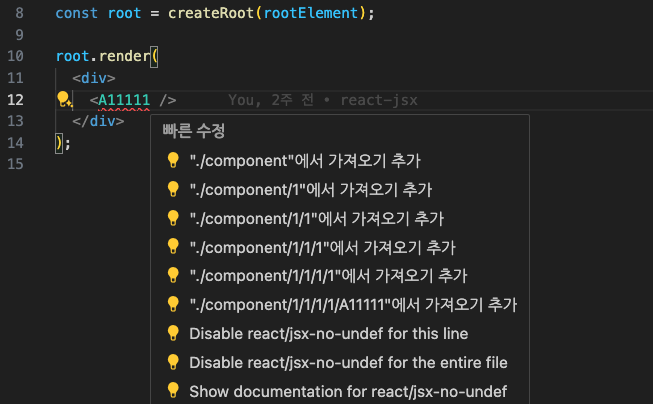
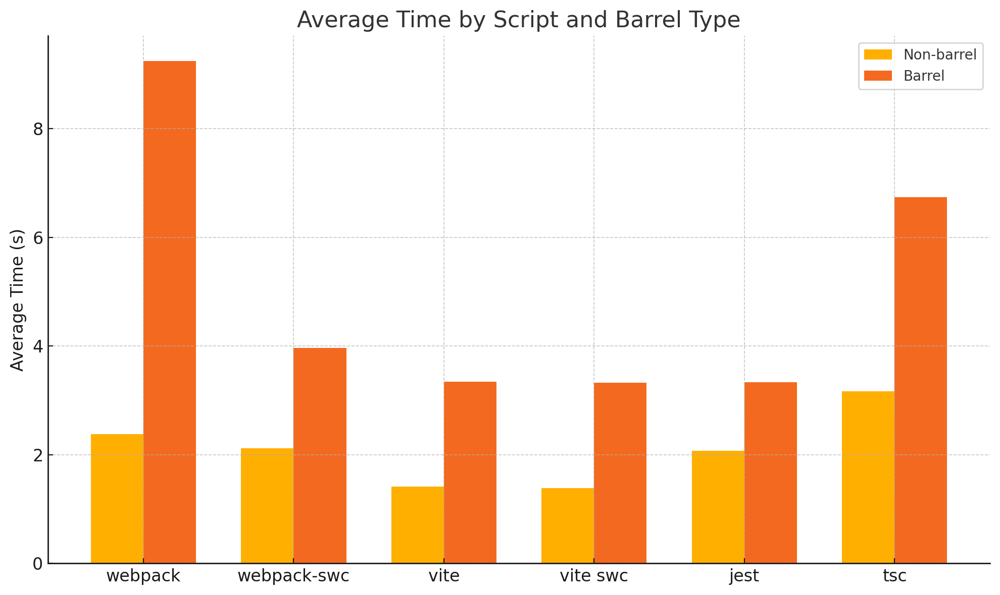
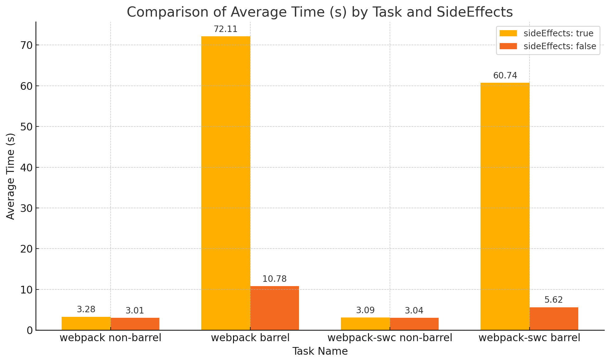
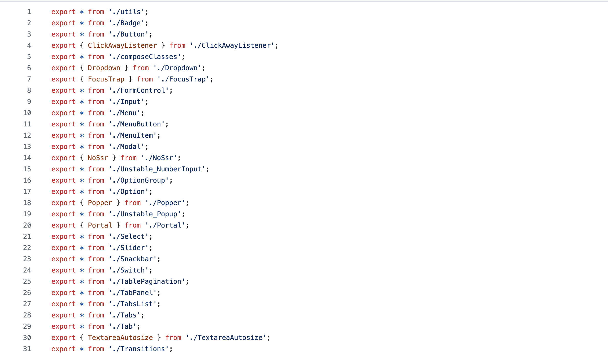

## What is a Barrel File?

```

src/
	components/
		Button.js
		Header.js
		Footer.js

```

Consider this folder structure:

```
import Button from './components/Button';
import Header from './components/Header';
import Footer from './components/Footer';
```

In a typical structure, you would import all these components like this:

```
// src/components/index.js
export { default as Button } from './Button';
export { default as Header } from './Header';
export { default as Footer } from './Footer';
```

By grouping these imports using a barrel file like the one above, you can simply import from `index.js` like this:

```
`import { Button, Header, Footer } from './components';`
```

By using a barrel file:

1. **Readability improves.** Barrel files simplify import statements, making the code cleaner.
2. **Maintainability improves.** Managing multiple modules in a single file means you only need to modify the barrel file if modules are added or changed (encapsulation).

## However

However, a barrel file is simply a re-exporting file, so each time the entire module map is drawn, an unnecessary file is loaded, causing additional time to be spent.

Moreover, in a feature-based folder structure, multiple re-exports might occur to show lower-level variables through feature-level imports.

```
// src/features/Novels/HarryPotter/someFunctionGroup/someFunction
export function someFunction(){

}
```

```
// src/features/Novels/HarryPotter/someFunctionGroup/index.js
export * from './someFunction'
```

```
// src/features/Novels/HarryPotter/index.js
export * from './someFunctionGroup'
```

```
// src/features/Novels/index.js
export * from './HarryPotter'
```

```
// src/pages/somePage
import {someFunction} from 'Features/HarryPotter'
```

You should reconsider whether using a Barrel File is really beneficial.



In reality, even if you use barrel files to block content in JS, it is impossible to completely encapsulate something from another file. For example, in an IDE, import autocomplete functions can still show what is hidden by the barrel, making it accessible and revealing the content.

So while the conceptual separation using a barrel file is meaningful, complete abstraction is difficult. Also, the argument for using barrel files purely for the readability of import statements is less convincing in modern development environments where imports are often handled automatically.

# No Barrel Files

Recently, some argue that JS barrel files slow down builds and should be removed, with related work being done for performance improvements.

Marvinh tested this through module load time benchmarks and argued that using barrel files is an expensive task and should not be done recklessly. However, the overhead time presented by the number of modules did not resonate intuitively. I was curious how much performance actually differs without using barrel files and importing directly.

## How much difference in build time?

The structure tested is as follows:

```
// ./components/index.ts
export * from "./1";

export * from "./2";

export * from "./3";

export * from "./4";

export * from "./5";

export { default as A1 } from "./A1";

export { default as B1 } from "./B1";

export { default as C1 } from "./C1";

export { default as D1 } from "./D1";

export { default as E1 } from "./E1";
```

```
// ./components/1/index.ts
export { default as A11 } from './A11';

export { default as B11 } from './B11';

export { default as C11 } from './C11';

export { default as D11 } from './D11';

export { default as E11 } from './E11';

export * from './1';

export * from './2';

export * from './3';

export * from './4';

export * from './5';
```

This recursive structure was created to dramatically demonstrate the speed degradation caused by module loading due to barrel files. The components themselves are very simple:

```
// ./components/1/A.tsx
const A = () => {
return <div>A Component</div>;

};
export default A;
```

If there are 5 layers:
6(index.ts + A.tsx + B.tsx ..... + E.tsx) \* (5^0 + 5^1 + 5^2 + 5^3 + 5^4)
You would have a total of 4686 modules.

## Build Results


The following image shows the benchmark results with and without barrel files. The left orange bar (non-barrel) shows significantly faster results compared to the right dark orange bar (barrel).

Spec:

- CPU: M1 Pro
- RAM: 16GB

Up to a 5x difference (webpack) can be observed.

In jest, there is a performance difference of almost 2x, even with the cache option enabled. Without `cache`, the difference is more than 5x:

- Barrel: 14.5 seconds
- Non-barrel: 2.8 seconds

## Does using webpack `sideEffects` help?

Webpack assumes that all files have side effects when bundling. The side effect refers to any impact that a function has besides returning a value, such as modifying a global variable.

## What Are Side Effects?

Side effects refer to any additional impact that occurs when code is executed, beyond just the return value of a function. This can include modifying external states, interacting with external systems, or producing output, among other things. In programming, side effects often involve changes to variables, data structures, files, or other parts of the program's environment that exist outside the scope of the function being executed.

```
// fileToBeImported.js
export const value = 42;

window.myGlobalVar = 'Hello, world!';
```

Code like the one above initializes a global variable, which can cause unintended effects if not included in the bundle. Therefore, webpack conservatively performs tree-shaking to ensure the bundle's functionality.

By marking folders as side-effect free in `package.json` with the `sideEffects` option, you can improve tree-shaking, but it won't significantly improve build speed since the module map still needs to be traversed.

## What if each component has external dependencies?

\
![[output (2).png]]

By marking folders as side-effect free in `package.json` with the `sideEffects` option, you can improve tree-shaking, but it won't significantly improve build speed since the module map still needs to be traversed.

## What if each component has external dependencies?

```
// ./components/1/A.tsx
import _ from "lodash";

const A= () => {
	const empty = _.isEmpty("");
	return <div>A {empty} Component</div>;
};

export default A;
```

Let's change the code to use `lodash` as shown above.
This is more like a real React Component than the previous pure React Component.



70 seconds.

What's wrong with `webpack barrel` script?

You can understand the reason by looking at the code before minification.

Since `lodash` is imported, the code assumes there might be side effects and includes all the files from the barrel file in the bundle. Afterward, Terser performs Dead Code Elimination, but the Terser plugin’s poor performance is what causes the issue!

By default, Webpack has optimization enabled, and the Terser plugin runs for Dead Code Elimination even without additional configuration. However, Terser is so slow that what would take 3 seconds without a barrel file can take up to 70 seconds with one!

In such cases, using `sideEffects: false` helps. Although you’re importing through Barrel Imports, files that aren’t being used won’t be included in the bundle, reducing the amount of code that needs to be minified and thus speeding up the process.

If you switch from Terser to the SWC Minifier, it doesn’t take as long as 70 seconds. However, it’s still not as fast as when you avoid using barrel files altogether!

## Next optimizePackageImports

https://vercel.com/blog/how-we-optimized-package-imports-in-next-js

Next.js has recently optimized package imports by addressing the performance impact of using barrel imports.



Next.js introduced a solution to optimize package imports through the `next-barrel-loader` Webpack plugin. This plugin converts barrel file imports to include only the necessary exports, thereby improving performance.

Even for libraries that have `sideEffect: false` specified, tree-shaking works correctly. However, the process of loading all modules to analyze and tree-shake them can be time-consuming.

To tackle this, Next.js employs the `next-barrel-loader` Webpack plugin, which transforms barrel file imports to retain only the necessary exports from the barrel file. The process involves creating an export map like the one shown below:

```
export const __next_private_export_map__ = '[["a","./a","a"],["b","./b","b"],["c","./c","c"],...]'
```

This JSON-formatted export map is generated by SWC, where each array element represents:

```
 ["<imported identifier>", "<import path>", "<exported name>"]
 e.g.: import { a as b } from './module-a' => '["b", "./module-a", "a"]'
```

```
  const exportMap = new Map<string, [string, string]>()
  for (const [name, path, orig] of exportList) {
    exportMap.set(name, [path, orig])
  }
```

Next, the export map is created from the JSON:

```
for (const name of names) {
  if (exportMap.has(name)) {
    const decl = exportMap.get(name)!

    if (wildcard && !decl[0]) {
      decl[0] = this.resourcePath
      decl[1] = name
    }

    if (decl[1] === '*') {
      output += `\nexport * as ${name} from ${JSON.stringify(decl[0])}`
    } else if (decl[1] === 'default') {
      output += `\nexport { default as ${name} } from ${JSON.stringify(
        decl[0]
      )}`
    } else if (decl[1] === name) {
      output += `\nexport { ${name} } from ${JSON.stringify(decl[0])}`
    } else {
      output += `\nexport { ${decl[1]} as ${name} } from ${JSON.stringify(
        decl[0]
      )}`
    }
  } else {
    missedNames.push(name)
  }
}
```

If a wildcard import is used and the `name` is not in the exportMap, the plugin handles this by specifying it and recursively resolving the issue:

```
if (missedNames.length > 0) {
for (const match of wildcardExports) {
  const path = match[1]

  output += `\nexport * from ${JSON.stringify(
	path.replace('__PLACEHOLDER__', missedNames.join(',') + '&wildcard')
  )}`
}
}
```

While Next.js’s approach is more efficient than evaluating each import during a Webpack build, it still involves additional costs due to the inclusion of a separate barrel optimizer plugin.

Since code in external libraries is beyond our control, this approach is necessary. However, if we’re dealing with application code, avoiding barrel files altogether would be a much simpler way to achieve performance improvements.

## Conclusion

Using barrel files can indeed slow down your build process. Barrel files pose a significant risk of reducing build performance, especially if misused, so caution is warranted.

###### Opinion

Given that your team likely has established workflows, I wouldn't say "DO NOT USE BARREL FILES RIGHT NOW!" too strongly. However, if you’re creating barrel files for every folder without a clear need, it’s worth reconsidering this practice.
